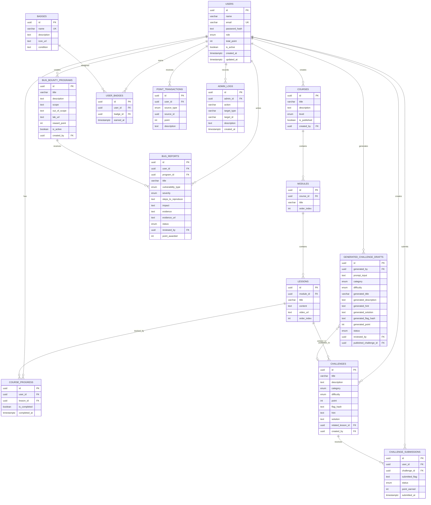
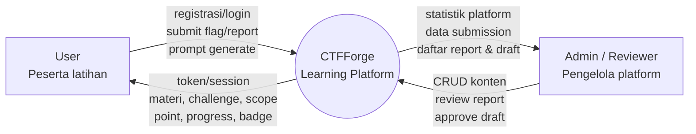
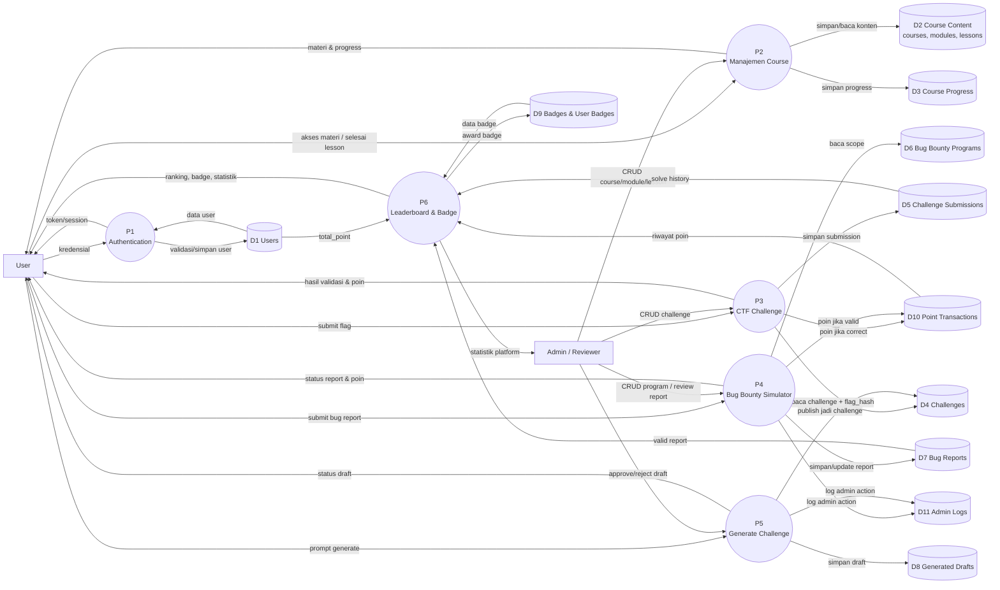

# CTFForge 🛡️

**CTFForge** adalah sebuah platform pembelajaran keamanan siber (cybersecurity learning) fullstack terintegrasi. Platform ini menggabungkan jalur pembelajaran terstruktur (*Structured Learning Paths*), latihan praktis CTF (*Capture The Flag*) dengan lab interaktif terintegrasi, simulasi pemburuan celah keamanan (*Bug Bounty Simulator*), asisten pembuat tantangan dinamis (*Challenge Draft Generator*), dan konsol pengawasan administratif (*Admin Console & Audit Trail Logs*).

Aplikasi ini dibangun menggunakan framework **Next.js (App Router)**, **Prisma ORM**, database **SQLite** (zero-setup untuk pengujian lokal), dan didekorasi dengan gaya visual **Cyberpunk Neon/Glassmorphism** menggunakan **Tailwind CSS v4**.

---

## 🚀 Fitur Utama & Arsitektur Solusi

1. **Structured Learning Paths**: Modul belajar keamanan siber dari tingkat pemula hingga mahir dengan pelacakan kemajuan (*progress tracking*) per materi.
2. **Interactive CTF Challenges**: Latihan praktis Capture The Flag dengan tab simulator interaktif di dalam halaman soal (contoh: Lab SQL Injection Login Bypass).
3. **Bug Bounty Simulation**: Workspace audit keamanan aplikasi sandbox (contoh: toko online *CyberShop* & layanan keuangan *CyberTrust*) lengkap dengan formulir pelaporan celah terstandar.
4. **Challenge Draft Generator**: Memungkinkan pengguna membuat rancangan soal CTF secara otomatis menggunakan generator prompt terstruktur, yang kemudian di-review oleh admin sebelum dipublikasikan live.
5. **Admin Console & Audit Trail**: Dasbor moderasi admin untuk memeriksa kiriman laporan bug, menyetujui draf soal generator, mengelola course/challenges, serta meninjau catatan log audit administrator secara transparan.

---

## 🔒 Mekanisme Pertahanan & Keamanan Kode (Secure Coding)

* **Validasi Skema Masukan**: Validasi Zod digunakan untuk memastikan struktur, tipe data, panjang input, dan enum request sesuai aturan sebelum diproses oleh API.
* **Pencegahan SQL Injection**: Diperkuat melalui penggunaan Prisma ORM dan penghindaran raw query tidak aman, sehingga database SQLite terproteksi dari bypass otentikasi.
* **Mitigasi XSS**: Risiko XSS dikurangi melalui output escaping bawaan React, validasi input, dan rencana penerapan security headers/CSP.
* **Security Headers**: HTTP Response Headers dikonfigurasi pada `next.config.ts` untuk mengaktifkan `X-Frame-Options: DENY`, `X-Content-Type-Options: nosniff`, serta kebijakan Referrer & Permissions.
* **Rate Limiting**: Throttling masukan di-enforce menggunakan algoritma *token-bucket* in-memory untuk membatasi pengiriman formulir pada rute API kritis (Login, Registrasi, Submisi Flag, Pembuatan Soal, dan Laporan Bug).

---

## 🛠️ Panduan Instalasi & Menjalankan Aplikasi

Ikuti langkah-langkah di bawah ini untuk menjalankan CTFForge di lingkungan lokal Anda:

### 1. Prasyarat
Pastikan Anda telah menginstal **Node.js** (versi 18+) dan **npm** di komputer Anda.

### 2. Instal Dependensi
Jalankan perintah berikut pada terminal di direktori utama proyek:
```bash
npm install
```

### 3. Setup Lingkungan (.env)
Buat file bernama `.env` di direktori root (atau salin dari `.env.example`) dan isi variabel berikut:
```env
DATABASE_URL="file:./dev.db"
JWT_SECRET="ganti-dengan-kunci-rahasia-jwt-yang-panjang-dan-aman-disini-1337"
```
> **Catatan Keamanan**: Kunci rahasia JWT wajib diisi dan diubah agar aplikasi tidak *fail-fast* saat dijalankan.

### 4. Push Database & Seed Data
Buat database SQLite lokal `dev.db` dan jalankan pembenihan data awal (*database seeding*):
```bash
npx prisma db push
node prisma/seed.js
```

### 5. Jalankan Server Pengembangan
Jalankan perintah berikut untuk menyalakan server lokal:
```bash
npm run dev
```
Buka browser dan kunjungi: **[http://localhost:3000](http://localhost:3000)**

---

## 🔑 Kredensial Akun Uji Coba (Test Accounts)

Gunakan akun berikut untuk menguji masing-masing peran pengguna di platform:

| Peran Akun | Email | Password | Deskripsi Akses |
| :--- | :--- | :--- | :--- |
| **Administrator** | `admin@ctfforge.com` | `admin123` | Konsol admin, review bug reports, publish draf generator, audit logs. |
| **Cyber Cadet** | `user@ctfforge.com` | `user123` | Akses materi course, latihan CTF, sandbox bug bounty, generator soal. |
| **Bug Hunter** | `pemburu@ctfforge.com` | `pemburu123` | Akun siap pakai dengan reputasi awal 250 poin dan badge khusus. |

---

## 🎮 Panduan Walkthrough Eksploitasi (Interactive Labs)

### 1. Lab SQL Injection (Login Bypass)
* **Lokasi**: Menu **CTF Practice** ➔ Soal **SQL Injection: Login Bypass** (atau via materi pelajaran SQL Injection Dasar di **Learning Path**).
* **Vulnerability**: Form login tidak melakukan sanitasi input dan merangkai query SQL secara langsung.
* **Langkah Eksploitasi**:
  1. Klik tab **Interactive Lab** pada halaman tantangan.
  2. Pada input *Username*, masukkan payload bypass SQL klasik:
     ```sql
     ' OR '1'='1
     ```
  3. Kosongkan atau isi input *Password* secara bebas.
  4. Klik **Login**.
  5. Simulator lab akan memproses bypass query dan mencetak kunci flag:
     `CTF{sqli_l0g1n_byp4ss_succ3ss}`
  6. Salin flag tersebut dan submit pada form verifikasi jawaban untuk mendapatkan poin.

### 2. Lab Bug Bounty - CyberShop (Negative Coupon Vulnerability)
* **Lokasi**: Menu **Bug Bounty** ➔ Program **E-Commerce Marketplace (CyberShop)**.
* **Vulnerability**: Logic kupon diskon tidak memvalidasi nilai akhir checkout, memungkinkan nilai kupon diskon melebihi harga produk sehingga menghasilkan total transaksi negatif yang justru menambahkan saldo pengguna saat pembelian diselesaikan.
* **Langkah Eksploitasi**:
  1. Klik **Jalankan Simulator Lab Aplikasi**.
  2. Buka simulator belanja CyberShop dan masukkan item ke dalam keranjang.
  3. Masukkan kode kupon diskon custom berikut:
     ```text
     CUSTOM-DISC
     ```
  4. Klik **Terapkan Kupon**. Perhatikan total belanjaan Anda menjadi negatif (misal: `-Rp150.000`).
  5. Selesaikan checkout transaksi belanja. Saldo Anda akan bertambah secara instan.
  6. Salin kode bukti celah (*evidence key*) yang muncul:
     `EVIDENCE-CYBERSHOP-BAC-NEG-COUPON`
  7. Klik **Buat & Kirim Laporan Temuan Celah Baru** untuk melaporkannya kepada Administrator dan mendapatkan imbalan poin reputasi.

---

## 📊 Diagram Desain Database & Aliran Data

### Entity Relationship Diagram (ERD)



### Data Flow Diagram (DFD) Level 0



### Data Flow Diagram (DFD) Level 1


