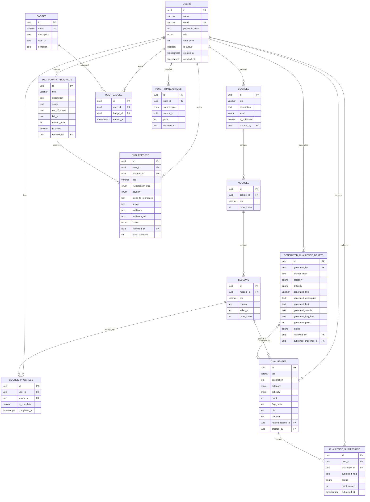
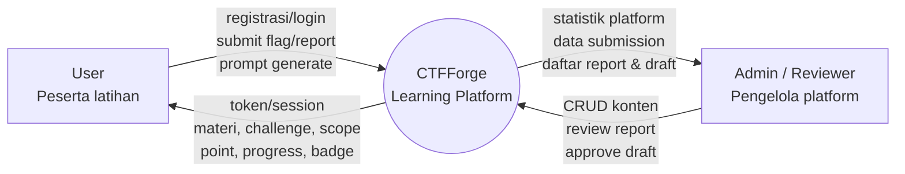
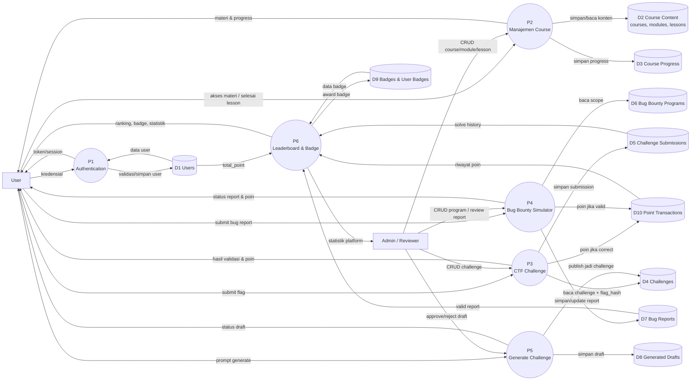

# CTFForge Final v3 — Mermaid Source

## ERD

```mermaid
erDiagram
  USERS {
    uuid id PK
    varchar name
    varchar email UK
    text password_hash
    enum role
    int total_point
    boolean is_active
    timestamptz created_at
    timestamptz updated_at
  }

  COURSES {
    uuid id PK
    varchar title
    text description
    enum level
    boolean is_published
    uuid created_by FK
  }

  MODULES {
    uuid id PK
    uuid course_id FK
    varchar title
    int order_index
  }

  LESSONS {
    uuid id PK
    uuid module_id FK
    varchar title
    text content
    text video_url
    int order_index
  }

  COURSE_PROGRESS {
    uuid id PK
    uuid user_id FK
    uuid lesson_id FK
    boolean is_completed
    timestamptz completed_at
  }

  CHALLENGES {
    uuid id PK
    varchar title
    text description
    enum category
    enum difficulty
    int point
    text flag_hash
    text hint
    text solution
    uuid related_lesson_id FK
    uuid created_by FK
  }

  CHALLENGE_SUBMISSIONS {
    uuid id PK
    uuid user_id FK
    uuid challenge_id FK
    text submitted_flag
    enum status
    int point_earned
    timestamptz submitted_at
  }

  BUG_BOUNTY_PROGRAMS {
    uuid id PK
    varchar title
    text description
    text scope
    text out_of_scope
    text lab_url
    int reward_point
    boolean is_active
    uuid created_by FK
  }

  BUG_REPORTS {
    uuid id PK
    uuid user_id FK
    uuid program_id FK
    varchar title
    enum vulnerability_type
    enum severity
    text steps_to_reproduce
    text impact
    text evidence
    text evidence_url
    enum status
    uuid reviewed_by FK
    int point_awarded
  }

  GENERATED_CHALLENGE_DRAFTS {
    uuid id PK
    uuid generated_by FK
    text prompt_input
    enum category
    enum difficulty
    varchar generated_title
    text generated_description
    text generated_hint
    text generated_solution
    text generated_flag_hash
    int generated_point
    enum status
    uuid reviewed_by FK
    uuid published_challenge_id FK
  }

  BADGES {
    uuid id PK
    varchar name UK
    text description
    text icon_url
    text condition
  }

  USER_BADGES {
    uuid id PK
    uuid user_id FK
    uuid badge_id FK
    timestamptz earned_at
  }

  POINT_TRANSACTIONS {
    uuid id PK
    uuid user_id FK
    enum source_type
    uuid source_id
    int point
    text description
  }

  USERS ||--o{ COURSES : creates
  USERS ||--o{ CHALLENGES : creates
  USERS ||--o{ BUG_BOUNTY_PROGRAMS : creates
  USERS ||--o{ GENERATED_CHALLENGE_DRAFTS : generates
  USERS ||--o{ COURSE_PROGRESS : has
  USERS ||--o{ CHALLENGE_SUBMISSIONS : submits
  USERS ||--o{ BUG_REPORTS : writes
  USERS ||--o{ USER_BADGES : earns
  USERS ||--o{ POINT_TRANSACTIONS : receives
  COURSES ||--o{ MODULES : contains
  MODULES ||--o{ LESSONS : contains
  LESSONS ||--o{ COURSE_PROGRESS : tracked_by
  LESSONS ||--o{ CHALLENGES : related_to
  CHALLENGES ||--o{ CHALLENGE_SUBMISSIONS : receives
  BUG_BOUNTY_PROGRAMS ||--o{ BUG_REPORTS : receives
  BADGES ||--o{ USER_BADGES : assigned
  GENERATED_CHALLENGE_DRAFTS }o--o| CHALLENGES : publishes_to
```

## DFD Level 0

```mermaid
flowchart LR
  U[User<br/>Peserta latihan]
  S((CTFForge<br/>Learning Platform))
  A[Admin / Reviewer<br/>Pengelola platform]

  U -- "registrasi/login<br/>submit flag/report<br/>prompt generate" --> S
  S -- "token/session<br/>materi, challenge, scope<br/>point, progress, badge" --> U

  A -- "CRUD konten<br/>review report<br/>approve draft" --> S
  S -- "statistik platform<br/>data submission<br/>daftar report & draft" --> A
```

## DFD Level 1

```mermaid
flowchart LR
  U[User]
  A[Admin / Reviewer]

  P1((P1<br/>Authentication))
  P2((P2<br/>Manajemen Course))
  P3((P3<br/>CTF Challenge))
  P4((P4<br/>Bug Bounty Simulator))
  P5((P5<br/>Generate Challenge))
  P6((P6<br/>Leaderboard & Badge))

  D1[(D1 Users)]
  D2[(D2 Course Content<br/>courses, modules, lessons)]
  D3[(D3 Course Progress)]
  D4[(D4 Challenges)]
  D5[(D5 Challenge Submissions)]
  D6[(D6 Bug Bounty Programs)]
  D7[(D7 Bug Reports)]
  D8[(D8 Generated Drafts)]
  D9[(D9 Badges & User Badges)]
  D10[(D10 Point Transactions)]

  U -- kredensial --> P1
  P1 -- token/session --> U
  P1 -- validasi/simpan user --> D1
  D1 -- data user --> P1

  U -- akses materi / selesai lesson --> P2
  P2 -- materi & progress --> U
  A -- CRUD course/module/lesson --> P2
  P2 -- simpan/baca konten --> D2
  P2 -- simpan progress --> D3

  U -- submit flag --> P3
  P3 -- hasil validasi & poin --> U
  A -- CRUD challenge --> P3
  P3 -- baca challenge + flag_hash --> D4
  P3 -- simpan submission --> D5
  P3 -- poin jika correct --> D10

  U -- submit bug report --> P4
  P4 -- status report & poin --> U
  A -- CRUD program / review report --> P4
  P4 -- baca scope --> D6
  P4 -- simpan/update report --> D7
  P4 -- poin jika valid --> D10

  U -- prompt generate --> P5
  P5 -- status draft --> U
  A -- approve/reject draft --> P5
  P5 -- simpan draft --> D8
  P5 -- publish jadi challenge --> D4

  D1 -- total_point --> P6
  D5 -- solve history --> P6
  D7 -- valid report --> P6
  D10 -- riwayat poin --> P6
  P6 -- award badge --> D9
  D9 -- data badge --> P6
  P6 -- ranking, badge, statistik --> U
  P6 -- statistik platform --> A
```
